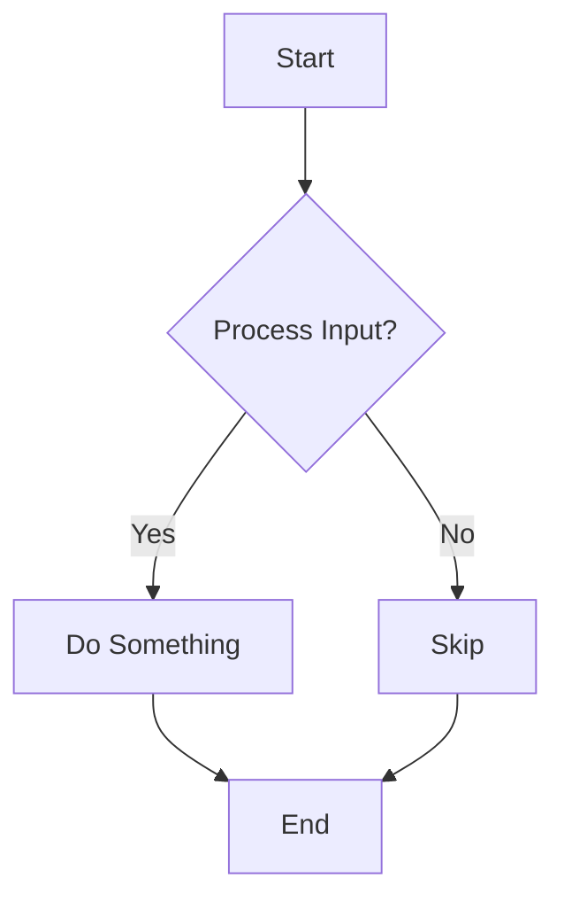

# Welcome to My Blog!

This is the content of my first blog post. I'm excited to share my thoughts here.

## Features of this generator

*   **Markdown Support**: Write your content in easy-to-read Markdown.
*   **Templating with Twig**: Flexible and powerful templating for consistent design.
*   **SEO & Social Sharing**: Built-in meta tags for better visibility.
*   **Tagging System**: Organize your posts and create themed landing pages.
*   **Static Pages**: Easily create "About" or "Contact" pages for your site menu.
*   **Mermaid Diagrams**: Embed beautiful diagrams directly in your Markdown!

### An example Mermaid Diagram

I hope you enjoy reading!
